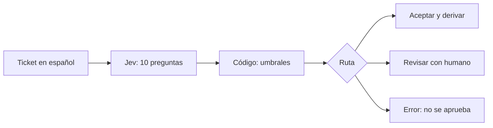
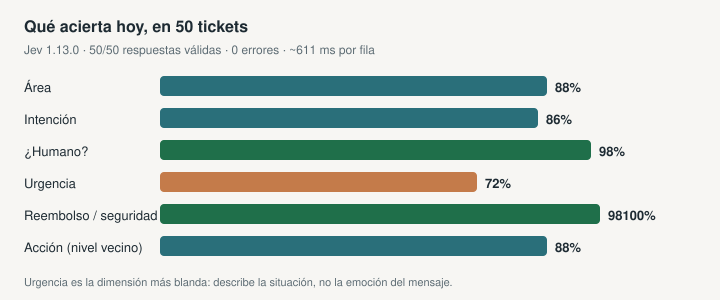
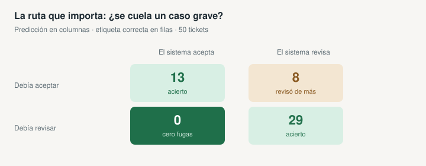
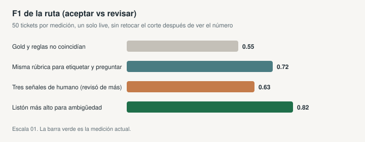

# Catalog Judge

Un inbox de soporte no se resuelve con un chatbot que redacta. Se resuelve
**derivando bien**: quién es dueño del caso, qué tan urgente es, si un humano
tiene que entrar, y si hay una acción clara.

Este repo hace eso con filas, no con conversación. **Jev** (TypeSafe 1.13.0)
lee el texto de un ticket en español y responde diez preguntas cerradas. **El
código** arma la ruta: aceptar, revisar o bloquear. Los números de demanda
(ventas, promociones, caídas) no pasan por el modelo: una política escrita
los corta.

No hay LLM generativo. No se inventa stock. No se “pregunta al modelo qué
umbral usar”.

## Para qué sirve

| Situación | Lo que suele hacerse | Lo que hace esto |
|---|---|---|
| 50–200 tickets al día | Una persona lee y etiqueta a mano, o un GPT escribe una respuesta | Una llamada por ticket, diez juicios, una ruta |
| Fraude, acceso indebido, caída | Se pierde en el mismo inbox que “¿cuál es el horario?” | Revisión obligatoria; en la medición actual **cero fugas** hacia aceptar |
| Series de venta (tienda × familia) | Un dashboard o un Excel con reglas sueltas | La misma política, versionada, sobre 96 series públicas |
| Auditoría | “El modelo dijo que sí” | Evidence JSON con hashes, sin el texto del cliente |

Sirve como demo de **clasificación barata y auditable**: útil en soporte,
operaciones o un equipo de datos que no quiere un agente conversacional.

## Cómo fluye un ticket



Jev no elige “auto / review / human”. Dice cosas como *área = pagos*,
*¿es ambiguo? = 0.91*, *urgencia = alta*. El código traduce eso a una cola.

Las diez preguntas cubren dueño, intención, urgencia, tres motivos para un
humano (ambiguo, contradictorio, especialista), riesgo legal, reembolso,
si hay una acción ejecutable, y si un fallo técnico trae evidencia.

## Resultados

50 tickets nuevos, una sola corrida en vivo, **sin retocar reglas después de
ver el número**. 50/50 respuestas válidas, 0 errores, ~611 ms por fila.



| Qué se mide | Resultado | Lectura en una frase |
|---|---:|---|
| Ruta (aceptar vs revisar) | **F1 0.82** | El número que importa para operar |
| Área | 88% | Quién es dueño del problema |
| Intención | 86% | Consulta, reclamo, solicitud… |
| ¿Hace falta un humano? | **98%** | Ambigüedad, contradicción o especialista |
| Urgencia | 72% | La dimensión más blanda |
| Seguridad / reembolso / repro | 98–100% | Casi no se equivoca en las banderas duras |
| Acción (nivel vecino) | 88% | Si hay tarea, aunque el nivel exacto falle |

Retail (20 series, solo código): decisión, riesgo y excepción **1.00**. Ese
1.00 es una prueba de regresión: el gold salió de la **misma** función. No es
una métrica de modelo.

### ¿Se cuela un caso que debía revisar?



|  | El sistema acepta | El sistema revisa |
|---|---:|---:|
| Debía aceptar | 13 | 8 |
| Debía revisar | **0** | 29 |

El sesgo es a propósito: **mejor revisar de más que dejar pasar un caso
grave**. Ocho tickets extra van a revisión; ninguno que debía revisar se
aceptó.

### Cómo se llegó a 0.82

No es un número sacado de un notebook. Cada barra es un lote **nuevo** y un
solo live. Si una idea no mejoraba la ruta, se dejaba documentada y se
medía otra vez, no se re-etiquetaba el mismo CSV.



| Qué cambió | F1 de ruta | Qué se aprendió |
|---|---:|---|
| El gold y las reglas no coincidían | 0.55 | El modelo no era el techo; la rúbrica sí |
| Misma rúbrica para etiquetar y preguntar | 0.72 | Jev rinde cuando le preguntas lo mismo que etiquetaste |
| “¿Humano?” partido en tres señales | 0.63 | Ambigüedad disparaba demasiado: el inbox se llenó de revisión |
| Listón más alto para llamar algo ambiguo | **0.82** | Menos falsos “esto es vago”; sigue fall-closed |

Hashes, matrices y el cuaderno de medición:
[`evaluations/README.md`](evaluations/README.md).

## Dos trabajos distintos a propósito

**Texto → Jev.** Un ticket no es un número. Un modelo chico, diez preguntas,
una llamada. Preguntar treinta cosas cuesta casi lo mismo que preguntar una
([fan-out](https://docs.typesafe.ai/patterns/fan-out)).

**Números → código.** Ventas, coeficientes, % promo. Pedirle a Jev
“¿incluyo esta serie?” cuando el gold ya son esos cortes es circular. La
política está en [`retail/policy.json`](retail/policy.json). El fixture no
trae SKU, stock ni margen: es demanda pública
`tienda × familia`, no un catálogo.

| | Tickets | Demanda |
|---|---|---|
| Entrada | Asunto + cuerpo en español | Series públicas de Favorita |
| Quién juzga | Jev | Código |
| Salida útil | Cola, prioridad, aceptar/revisar | Incluir / revisar / excluir la serie |
| Lo que no hace | Redactar la respuesta al cliente | Inventar inventario |

## Probarlo en local

Sin key ni red:

```bash
python -m venv .venv
. .venv/Scripts/activate
python -m pip install -e ".[dev]"
catalog-judge demo --limit 12
```

Tablero (Retail / Tickets / evidencia):

```bash
.venv/Scripts/streamlit.exe run app.py
```

El **mock** de tickets es una heurística para ver la interfaz. No es evidencia
de Jev. El live pide consentimiento y una key de TypeSafe; la key no se
imprime ni se versiona (`.env.example`).

## Datos y límites

- Tickets: corpus público curado al español
  ([Tobi-Bueck](https://huggingface.co/datasets/Tobi-Bueck/customer-support-tickets),
  CC BY-NC 4.0) más lotes originales para medir. No se versiona el raw.
- Demanda: muestra pública del dataset Favorita; no hay relación con la
  empresa y no hay stock.
- **n = 50** es para reproducir y detectar bugs de contrato, no para vender
  un benchmark de producción.
- Un juicio válido puede estar equivocado. La sanitización de PII es una
  barrera básica, no anonimización: no envíes datos internos a la API.
- Un timeout o un contrato incompleto produce `error`, nunca un “sí” silencioso.

Fuentes, hashes y licencias: [`DATA_SOURCES.md`](DATA_SOURCES.md) ·
[`SECURITY.md`](SECURITY.md) · [`LICENSE`](LICENSE) (MIT para el código).

## Referencias

- [Jev / TypeSafe](https://docs.typesafe.ai/primitives)
- [Confidence routing](https://docs.typesafe.ai/patterns/confidence-routing)
- [Por qué Jev 1.13 es “dentado”](https://docs.typesafe.ai/model-jaggedness/jev-1.13)
